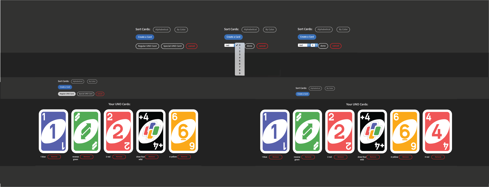
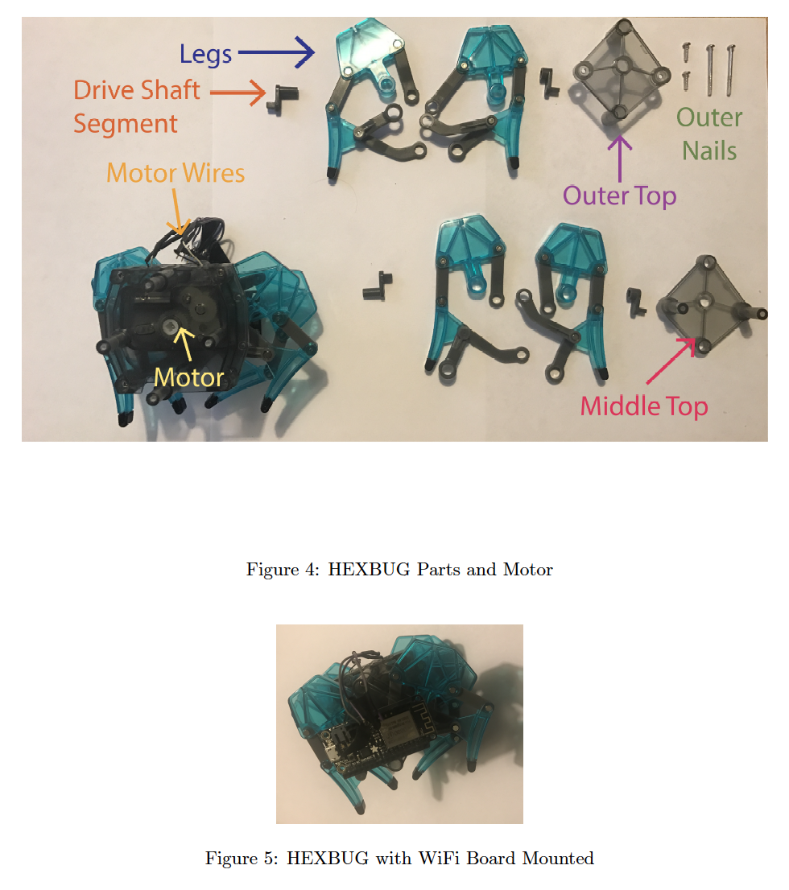
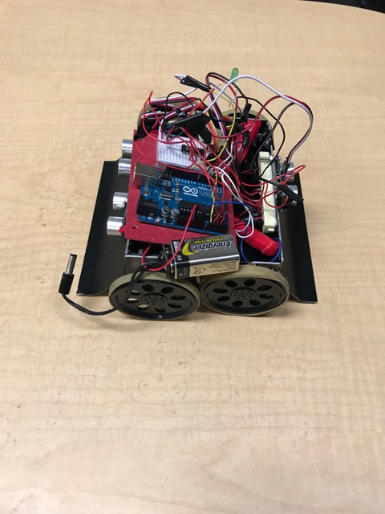
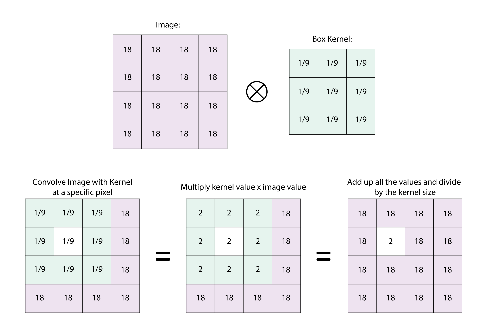

## Welcome to my portfolio!
### Concentration: Computational Perception and Robotics
- [Github](https://github.com/ConnieC14)
- [Linkedin](https://www.linkedin.com/in/consuelocuevas)

## Projects
### Markov Decision Processes

#### Gridworld
In this MDP I try to model a more simple and traditional path finding problem with a slight twist
on movement. I define a 5 by 5 grid world with cells that have positive and negative reward for
landing on them. An agent is placed at the bottom of the board and has to make its way up
toward the reward square. Its movement is limited to one unit to the left, right, and up. If the
agent tries to move off the board, it is bounced back to its current position. The alteration I made
to the movement is the slight possibility of overshooting. With probability p, the agent will move
1 space but with probability 1-p, it will overshoot and travel 2 spaces in the chosen direction
(unless it would be placed outside the board). The board is shown below.

#### Yahtzee Simplified Die Game
This Markov Decision Process is inspired by the game Yahtzee in which a player has 3 tries
to roll dice in order to score points depending on what the final outcome is. In my version, the
player first rolls two dice, one blue and one red. The player then has two more opportunities to
either reroll the blue die, the red die, both die, or neither. After the 3 tries have been used, the
player is awarded points depending on the values on the dice. If the dice match, the player is
awarded 10 points, otherwise, the player is awarded points equal to the value on the blue die
minus the value on the red die.
Generate a MDP example based on a modified yahtzee inspired die game.
    This function is used to generate a transition probability
    (``A`` × ``S`` × ``S``) array ``P`` and a reward (``S`` × ``A``) matrix
    ``R`` that model the following problem. 
    The game is managed by two dice numbered {1-6} with each turn consisting of 
    four actions:
    - Re-roll blue die {action 0}
    - Re-roll red die  {action 1}
    - Re-roll both     {action 2}
    - Re-roll None     {action 3}
    
    An action is decided with the objective to maximize the final score 
    at the final state when the number of turns are over.
    
    Let {0, 1 . . . ``S``-1 } be the states of each turn and the resulting dice rolls.
    
    
    The transition matrix ``P`` of the problem can then be defined as follows:
[Code](https://github.com/ConnieC14/Markov_Decision_Processes)

### Naive Wiggle Stereoscopy Gifs
The original scope of the project was to recreate the results in the paper “Kinetic Depth Images: Flexible Generation of Depth Perception”. In it, the researchers expand on the concept of wiggle stereoscopy by creating smooth transitions between the two stereoscopic images rather than jumping between images. They do this by producing a depth map of the scene from the two stereoscopic images and transforming the images to render intermediate frames between the locations of the two images. In addition, to this, they try to maximize the perceived 3D effect of the gif by calculating an energy map for the image using depth, inverted saliency, and centrality. Using this energy map, a pivot axis is established which enhances the perceived 3D effect. I intended to recreate these elements to produce my own smooth 3D wiggle gifs.

It became clear almost immediately that the scope of the project would have to be reduced as soon as I set out to code and implement the different elements of the KDI paper. The main issue was that there was very little guidance or explanation behind the calculations for saliency and the depth mesh. The paper also briefly named the method for producing intermediate frames without providing resources or explaining the method. Overall it was infeasible to implement all the elements that went into the paper under those circumstances.

Rather than attempting to implement all the aspects of the paper, I decided to approach the project holistically. I needed to produce a gif that would smoothly transition between the stereoscopic images. To do this, I needed to produce the intermediate frames. I focused my attention only on implementing the concepts and methods in the paper that would directly aid in producing these frames. Thus, I limited the scope of the project to generating depth maps and constructing the transport maps that generated those frames.
[Code](https://github.com/ConnieC14/Naive_Wiggle_Stereoscopy_Gifs)

### AI-Battleship
Rules:
1. Each player arranges ships according to fleet
2. Take turns firing a shot
3. Mark Hits and Misses
4. Call out when a ship has been sunk
5. Sink all to win
Ships:
* Carrier - 5
* Battleship - 4
* Cruiser - 3
* Submarine - 3
* Destroyer -2
* 10 Rows x 10 Columns
[Code](https://github.com/ConnieC14/AI-Battleship)

### UNO Card Sorter
This Project is a sample app that simulates an UNO card game. Current functionality shows the deck you have and allows you to add card, filter them, and sort them. Functionality is to be expanded into a fully functioning card game.
[Code](https://github.com/ConnieC14/UNO)

### HEXBUG Tarantula
This project showcases only the parts where commands were being sent to the HEXBUG Tarantula to move it forward, backwards and to turn right or left.

#### Using Arduino UNO to Connect to HEXBUG Controller
- The arduino folder contains code used to program an Arduino board soldered to the HEXBUG Tarantula's IR Controller. By wiring to the metal contact plates in the controller, the Arduino board can directly push commands to the Tarantula.

#### Using the ESP8266 WiFi Board to Connect to HEXBUG
- After successfully linking to the Infrared Remote Control, the HEXBUG Tarantula itself was pulled apart and resoldered to an ESP8266 WiFI Board. The IR Receiver was removed and the board was mounted to it. The goal was to use the WiFi board and communicate with the Tarantula using only python scripts. To do this I programmed using a library called PySerial to communicate through the Arduino's serial port.
[Code](https://github.com/ConnieC14/HEXBUG-Tarantula)

### Sumobot Robot Controller
This project was made with the purpose of creating a robot that will compete in a tournament to push the enemy robot out of the arena. The robot uses a QTI sensor to detect whether it is in or out of bounds of the arena and a sonar to detect the respective oponent's location.

#### Strategy
- The main strategy of this robot is to use the 3 sonar's attached to it to help find the opposing robot. The idea behind the 3 sonars is to take advantage of its wider field of vision. This will help it quickly find the opponent and start lunging towards it, before the opponent finds it. It has a defensive strategy that moves away from the bound if it detects it and an offensive strategy that will push the opponent until it is out of bounds.
[Code](https://github.com/ConnieC14/Sumobot_Robot_Controller)

### KESMBA Brain Network Vector Data
Texas A&M University, Computer Science Department: Keyser Lab
- Implemented image-filtering techniques in 3D using a Gaussian smoothing filter, downsampling algorithm, and a 2D directional filter on dataset of 3D high-resolution mouse brain images.   
- Extracted vector data using directional filter from the mouse brain dataset and visualized blood-vessel flow patterns.

## Art

